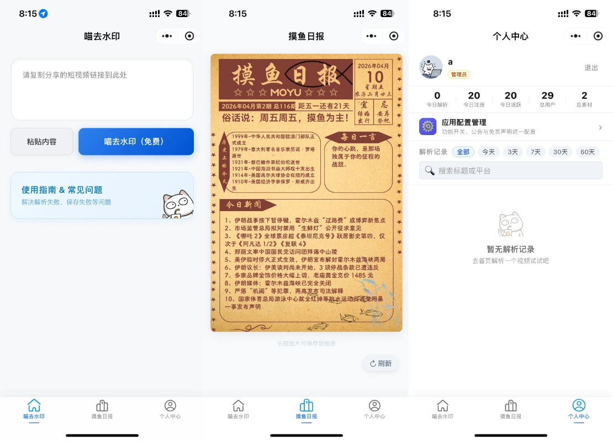
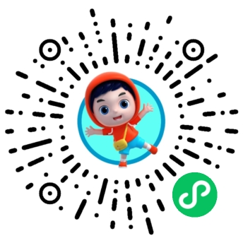

<div align="center">


# 拿捏去水印 (parse-mp)

**多平台短视频去水印微信小程序**

[](LICENSE)
[](https://mp.weixin.qq.com/)
[](https://developer.mozilla.org/en-US/docs/Web/JavaScript)
[](#-核心功能)

<p align="center">
  <a href="#-立即体验">立即体验</a> •
  <a href="#-核心功能">核心功能</a> •
  <a href="#-快速开始">快速开始</a> •
  <a href="#-联系作者">联系作者</a>
</p>

一款专为创作者打造的**短视频素材获取工具**，支持抖音、快手、小红书、西瓜、最右、A站、虎牙、Twitter、TikTok、YouTube 等 15+ 主流平台，一键获取无水印高清视频。

<p align="center">
  
</p>

</div>

---

## 📱 立即体验

| 小程序端 | 网页端 |
|:---:|:---:|
| 微信扫码体验 | [1.vlin.top](https://1.vlin.top) |
|  | [](https://1.vlin.top) |

> 本仓库仅包含前端小程序代码，核心解析能力由后端服务提供。

---

## 💎 核心功能

- **一键去水印**：粘贴分享链接，调用后端 `/api/parse` 接口，自动提取无水印直链
- **高清保存**：无水印视频/封面图直接保存至手机相册
- **摸鱼日报**：内置热门内容排行，发现优质素材
- **解析历史**：个人中心记录历史解析，随时回看
- **多平台覆盖**：抖音、快手、小红书、B站、西瓜、TikTok、YouTube 等 15+ 平台

---

## 💾 技术栈

| 维度 | 技术 | 说明 |
|---|---|---|
| **框架** | 微信小程序原生框架 | 最佳性能与原生交互体验 |
| **语言** | JavaScript / WXML / WXSS | 标准小程序开发技术栈 |
| **基础库** | 3.10.3+ | 适配最新微信 API |
| **开发工具** | 微信开发者工具 | 官方标准调试环境 |

---

## 🚀 快速开始

### 1. 克隆项目

```bash
git clone https://github.com/hzui/parse-mp.git
cd parse-mp
```

### 2. 关键配置

**`project.config.json`** — 填入你自己的小程序 AppID：

```json
{
  "appid": "你的AppID"
}
```

**`utils/config.js`** — 修改为你部署的后端地址：

```js
const config = {
  baseURL: 'https://你的域名',
};
```

### 3. 导入 & 运行

1. 打开**微信开发者工具**
2. 点击「导入」，选择本项目根目录
3. 确认 AppID 后点击导入
4. 点击「编译」即可预览

---

## 📂 项目结构

```
parse-mp/
├── pages/
│   ├── index/          # 首页：链接输入与解析
│   ├── videoPlayer/    # 播放页：预览无水印视频
│   ├── moyu/           # 摸鱼日报：热门内容排行
│   ├── profile/        # 个人中心：用户信息与历史
│   ├── questions/      # 帮助与问题反馈
│   └── apiConfig/      # API 配置页
├── utils/
│   ├── config.js       # 全局配置（baseURL 等）
│   ├── request.js      # 网络请求封装
│   ├── file.js         # 文件下载与相册保存
│   ├── clipboard.js    # 剪贴板处理
│   ├── time.js         # 时间工具
│   ├── ui.js           # UI 工具
│   └── util.js         # 通用工具函数
├── custom-tab-bar/     # 自定义底部导航栏
├── images/             # 静态资源
├── app.js              # 全局逻辑
├── app.json            # 全局配置
└── app.wxss            # 全局样式
```

---

## 🔗 相关项目

- **后端服务**：部署解析核心能力，配合本前端使用
- **网页端体验**：[https://1.vlin.top](https://1.vlin.top)

---

## 📩 联系作者

遇到问题或有定制需求，欢迎通过以下方式联系：

- **Bug 反馈**：[GitHub Issues](https://github.com/hzui/parse-mp/issues)

---

## ⚖️ 开源协议

本项目基于 [MIT LICENSE](LICENSE) 协议开源。

> 免责声明：本项目仅供技术研究与学习交流使用，严禁用于任何违反法律法规的行为，由此造成的后果由使用者自行承担。
